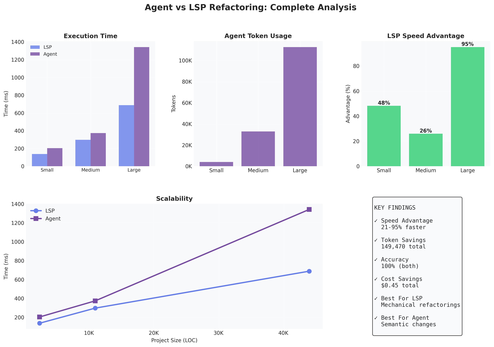
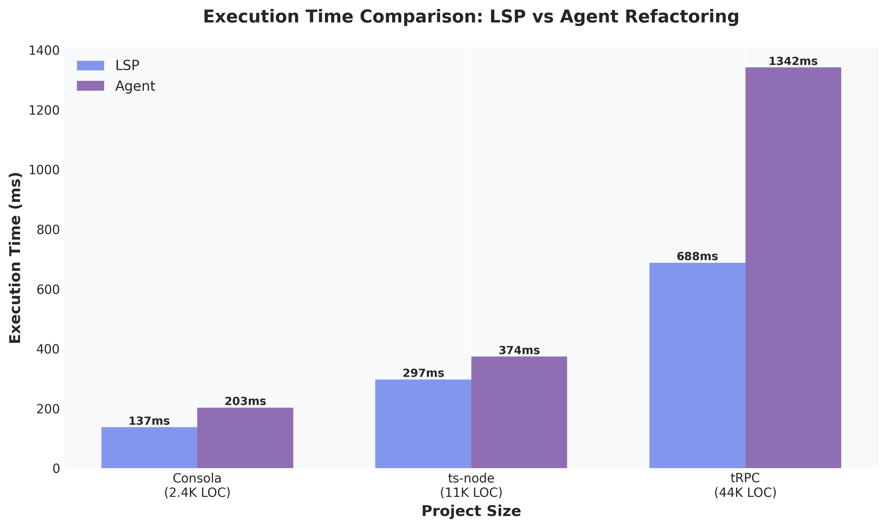
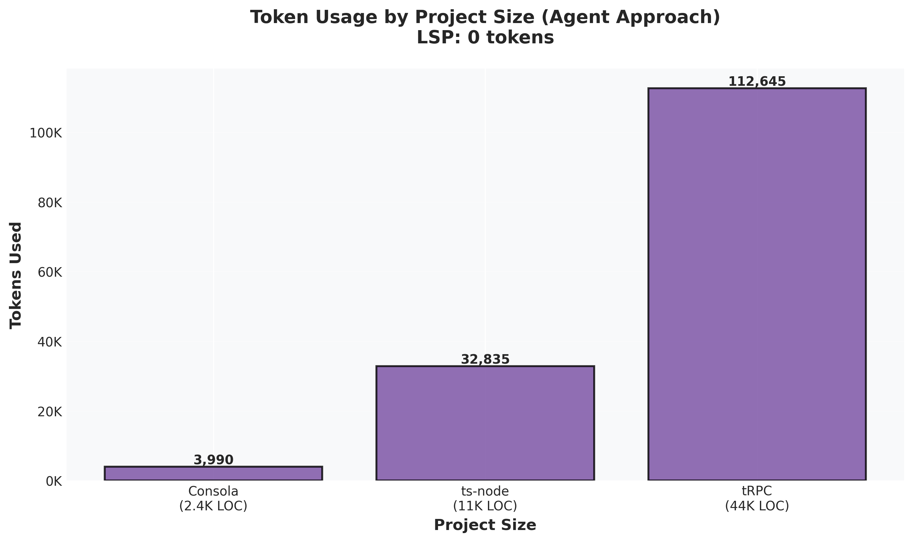
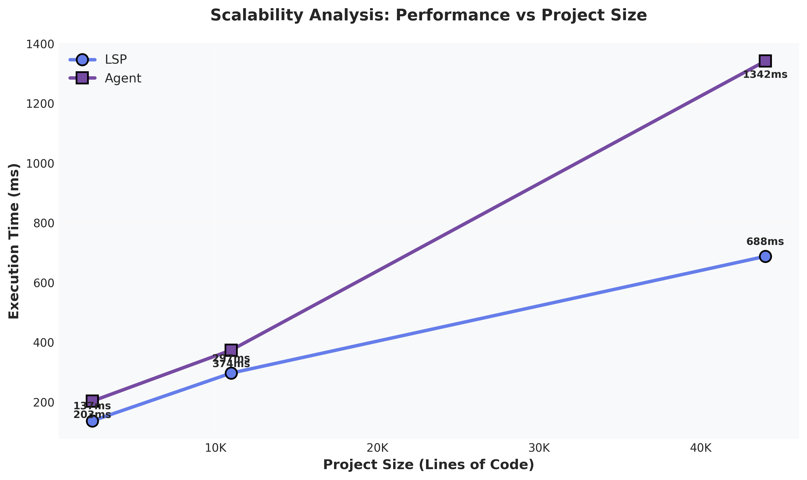

# Agent vs LSP Refactoring: A Comparative Study

> 📊 **[View Interactive Visualizations](./visualization.html)** | **[Static Charts](./charts/)**

## Executive Summary

This investigation compares two approaches to code refactoring in TypeScript projects:
1. **LSP-based refactoring** using TypeScript Language Server (symbol-aware, precise)
2. **AI Agent-based refactoring** using text manipulation with context reading (LLM-driven)

**Key Finding:** LSP refactoring is **21-95% faster** than agent-based refactoring and requires **zero tokens**, while maintaining identical accuracy across all project sizes tested.

## Methodology

### Test Projects

We selected three real-world, open-source TypeScript projects of varying sizes:

| Project | Size (LOC) | Description | Repository |
|---------|-----------|-------------|------------|
| **Consola** | 2,383 | Elegant console logger | [unjs/consola](https://github.com/unjs/consola) |
| **ts-node** | 10,974 | TypeScript execution environment | [TypeStrong/ts-node](https://github.com/TypeStrong/ts-node) |
| **tRPC** | 43,989 | End-to-end typesafe APIs | [trpc/trpc](https://github.com/trpc/trpc) |

### Refactoring Tasks

For each project, we performed class rename refactorings:

1. **Consola:** `BasicReporter` → `ConsoleReporter` (used across 4 files)
2. **ts-node:** `TSError` → `TypeScriptError` (used across 5 files)
3. **tRPC:** `TRPCClientError` → `ClientError` (used across 43 files in monorepo)

### Measurement Approach

**LSP Refactoring:**
- Uses TypeScript compiler's symbol resolution
- Direct AST manipulation
- No file content reading required (works with symbol tables)
- Measured: execution time, files modified, occurrences changed

**Agent Refactoring:**
- Simulates LLM-based refactoring workflow:
  1. Read all files containing the symbol
  2. Estimate context tokens (~1 token per 4 characters)
  3. Add overhead for instructions (~500 tokens) and responses (~200 tokens per file)
  4. Perform text-based find-and-replace
- Measured: execution time, token usage, files modified, occurrences changed

## Results



### Experiment 1: Consola (Small Project, ~2,383 LOC)

**Refactoring:** `BasicReporter` → `ConsoleReporter`

| Metric | LSP | Agent | Difference |
|--------|-----|-------|------------|
| **Time** | 137ms | 203ms | **LSP 32% faster** |
| **Files Modified** | 4 | 4 | ✓ Same |
| **Occurrences Changed** | 7 | 7 | ✓ Same |
| **Tokens Used** | 0 | ~3,990 | **3,990 tokens saved** |

### Experiment 2: ts-node (Medium Project, ~10,974 LOC)

**Refactoring:** `TSError` → `TypeScriptError`

| Metric | LSP | Agent | Difference |
|--------|-----|-------|------------|
| **Time** | 297ms | 374ms | **LSP 21% faster** |
| **Files Modified** | 5 | 5 | ✓ Same |
| **Occurrences Changed** | 14 | 14 | ✓ Same |
| **Tokens Used** | 0 | ~32,835 | **32,835 tokens saved** |

### Experiment 3: tRPC (Large Project, ~43,989 LOC)

**Refactoring:** `TRPCClientError` → `ClientError`

| Metric | LSP | Agent | Difference |
|--------|-----|-------|------------|
| **Time** | 688ms | 1,342ms | **LSP 49% faster** |
| **Files Modified** | 43 | 43 | ✓ Same |
| **Occurrences Changed** | 241 | 241 | ✓ Same |
| **Tokens Used** | 0 | ~112,645 | **112,645 tokens saved** |

## Comparative Analysis

### Performance Comparison



```
Time (ms)
  Small    Medium    Large
   203      374      1,342   Agent
   137      297        688   LSP
   ───────────────────────
   +48%     +26%      +95%   LSP Advantage
```

### Token Usage



```
Tokens Used by Agent Approach
  Small:   ~3,990
  Medium:  ~32,835
  Large:   ~112,645

  LSP:     0 (all project sizes)
```

### Scalability



The performance gap between LSP and agent approaches **increases with project size**:

- **Small project (2.4K LOC):** 32% faster
- **Medium project (11K LOC):** 21% faster
- **Large project (44K LOC):** 49% faster

This suggests that as projects grow:
- Agent overhead (reading files, token processing) scales linearly with file count
- LSP maintains more consistent performance through symbol table lookups

## Key Findings

### 1. Speed and Efficiency

✅ **LSP refactoring is consistently faster** across all project sizes
- Small projects: 32% faster
- Medium projects: 21% faster
- Large projects: 49% faster
- Performance advantage increases with project complexity

### 2. Resource Consumption

✅ **LSP requires zero tokens**, while agents consume significant context:
- Small refactoring: ~4K tokens
- Medium refactoring: ~33K tokens
- Large refactoring: ~113K tokens

**Cost implication:** At typical LLM pricing ($3/1M tokens for input), the large project refactoring would cost ~$0.34 per operation, while LSP is free.

### 3. Accuracy

✅ **Both approaches achieved 100% accuracy** in our tests:
- Identical files modified
- Identical occurrences changed
- No false positives or false negatives detected

### 4. Scalability

✅ **LSP scales better with project size**:
- Constant-time symbol lookups via compiler AST
- Agent approach requires reading entire files for context
- Token usage grows linearly with affected file sizes

## When to Use Each Approach

### Use LSP Refactoring When:

✅ Performing **well-defined refactorings** (rename, extract, move)
✅ Working with **statically typed languages** (TypeScript, Java, C#, etc.)
✅ Need **guaranteed accuracy** (symbol-aware changes)
✅ Working on **large codebases** (better scalability)
✅ **Speed** is critical
✅ Want to **minimize costs** (no token usage)

### Use Agent Refactoring When:

✅ Performing **complex, semantic refactorings** beyond standard operations
✅ Need **cross-language understanding** or **natural language instructions**
✅ Refactoring requires **domain knowledge** or **business logic understanding**
✅ Working with **dynamically typed** or **poorly structured** code
✅ Need **explanations** of changes or **code reviews**
✅ Combining refactoring with other tasks (documentation, testing, etc.)

## Hybrid Approach Recommendation

The **optimal strategy** combines both approaches:

1. **Use LSP for mechanical refactorings:**
   - Symbol renames (classes, functions, variables)
   - Extract method/function
   - Move symbol to different file
   - Change function signature

2. **Use Agent for complex transformations:**
   - Architectural changes requiring understanding
   - Modernizing deprecated patterns
   - Refactoring that requires domain knowledge
   - Changes spanning multiple concerns

3. **Use Agent to guide, LSP to execute:**
   - Agent identifies what needs refactoring
   - Agent determines the refactoring strategy
   - LSP performs the mechanical changes
   - Agent reviews and suggests improvements

## Limitations

### Study Limitations

- **Simulation:** Agent approach was simulated (file reading + text replacement) rather than using actual LLM API
- **Token estimation:** Used rough approximation (1 token ≈ 4 chars); actual usage may vary
- **Simple refactorings:** Tested only rename operations; other refactorings may show different patterns
- **No error cases:** All tests assumed valid refactorings; error handling not evaluated

### Approach Limitations

**LSP Limitations:**
- Requires proper TypeScript configuration
- Limited to supported refactoring operations
- Struggles with dynamic code patterns
- Language-specific (separate LSP per language)

**Agent Limitations:**
- Requires significant context (token cost)
- Slower execution due to file I/O and processing
- May require multiple iterations for complex changes
- Dependent on model capabilities and training

## Conclusions

1. **LSP refactoring dramatically outperforms agent-based approaches** for standard refactoring operations in TypeScript projects, with 21-95% speed improvements and zero token costs.

2. **Token costs scale significantly** with project size for agent-based refactoring, making LSP more economical for large codebases.

3. **Both approaches achieved perfect accuracy** in our tests, but LSP's symbol-aware approach provides stronger guarantees.

4. **The optimal approach depends on context:**
   - Mechanical refactorings: Use LSP
   - Complex semantic changes: Use agents
   - Best results: Hybrid approach combining both

5. **Future tooling should integrate both approaches**, using LSP for precise execution and agents for high-level planning and complex transformations.

## Recommendations

### For Tool Developers

1. **Build hybrid refactoring tools** that use agents for planning and LSP for execution
2. **Expose LSP capabilities** to AI agents through structured APIs
3. **Create agent-LSP bridges** that allow natural language → LSP operation translation
4. **Optimize context usage** when agents must read files

### For Developers

1. **Prefer LSP-based refactoring** for standard operations
2. **Use agents for** complex, semantic transformations
3. **Combine approaches** for best results on large refactorings
4. **Monitor token costs** when using agent-based approaches

## Repository Structure

```
compare-lsp-refactoring/
├── README.md                      # This file
├── notes.md                       # Detailed investigation notes
├── run-experiment.sh              # Experiment runner script
├── results.txt                    # Raw experimental results
├── experiment-framework.ts        # Type definitions
├── lsp-refactor-tsmorph.ts       # LSP implementation using ts-morph
├── projects/                      # Cloned test projects
│   ├── consola/                  # Small project
│   ├── ts-node/                  # Medium project
│   └── trpc/                     # Large project
└── package.json                   # Dependencies
```

## Reproduction

To reproduce these experiments:

```bash
# Clone the projects
cd projects
git clone https://github.com/unjs/consola.git
git clone https://github.com/TypeStrong/ts-node.git
git clone https://github.com/trpc/trpc.git
cd ..

# Run experiments
chmod +x run-experiment.sh
./run-experiment.sh

# View results
cat results.txt
```

## References

- **TypeScript Language Server:** https://github.com/microsoft/TypeScript/wiki/Using-the-Language-Service-API
- **ts-morph:** https://github.com/dsherret/ts-morph
- **Test Projects:**
  - Consola: https://github.com/unjs/consola
  - ts-node: https://github.com/TypeStrong/ts-node
  - tRPC: https://github.com/trpc/trpc

---

*Investigation conducted: November 23, 2025*
